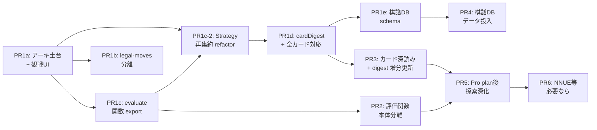

# Issue #193 対応計画 — AI/CPU アーキ刷新 + カード戦略統合 + CPU vs CPU 観戦

## 用語定義

本計画 md 内で使用する主な用語を以下に定義する。bench 数値や DoD で混乱しないよう冒頭で固定する。

| 用語 | 意味 |
|------|------|
| `maxDepth` | 反復深化探索の **設定上限値** (DIFFICULTY_PARAMS で定義、現行 expert=24)。「これ以上は探索しない」という上限値であって、必ず到達するわけではない |
| `depthCompleted` | 1 探索リクエストで **実際に完了した深さ**。時間制約 (timeLimitMs) で打ち切られると maxDepth 未満になる。bench 指標の主軸 |
| `targetReadingPly` | キャラ別の **棋力目安としての先読み手数** (Issue #193 本文より、さくら=1 / 武蔵=3 / 玄翁老師=5 / 龍王=6)。実際の `depthCompleted` とは独立した「ユーザー向けの強さ表現値」 |
| `nodes/sec` | 1 秒間に評価できた局面ノード数 (探索効率指標) |
| `byte-level equality` | 2 つの計算結果が 1 cp の差もなく完全に一致すること。リファクタリングの安全網として使う |
| `cardDigest` | 探索開始時 (root) で 1 回だけ計算する CardGameState の評価用ダイジェスト構造 (PR1d 設計の核) |
| `TurnAction` | AI 探索内で扱う統一行動型 (`move` / `draw` / `playCard`) |
| `TurnRules` | TurnAction の合法生成・適用・ターン終了判定を切替えるための抽象 |
| `spectatorMode` | CPU vs CPU 観戦モードを示す `gameConfig` 上のフラグ |

## Context

カード将棋アプリの根幹である CPU 思考は、現状以下の致命的なギャップを抱えている。

1. **CPU が CardGameState (マナ・手札・山札・トラップ・drawProgress) を一切参照していない**
   - 評価関数 `evaluate(state, variant)` は `GameState` のみ受け取り、カード状態を完全無視
   - `getFullLegalMoves` は駒指しのみ生成、ドロー/カード使用は探索候補に入らない
   - 結果として CPU は「通常将棋」と同じロジックで動作し、カード将棋の戦略性が片落ちしている (Issue #76 の本質)
2. **CPU vs CPU の観戦モードが存在しない**
   - 既存 `use-card-shogi-game` は `playerColor` 必須で人間プレイ前提、AI 同士の自動進行は未実装
3. **棋力指標として「龍王でも 2-3 手先の駒損を読み切れない」観察 (Issue #193 本文)**
   - `addNoise=0` 化済だが、評価関数の単一関数集約・Phase 3 探索専用 legal moves 未実装が要因
4. **ルール変更耐性がない**
   - 現行「1 ターン = 駒指し or カード or ドロー のいずれか 1 つ」を、将来「マナに応じて任意回数のドロー/カード使用 + 最後に必ず駒 1 手」に変更したい構想あり
   - reducer・探索・UI が「1 アクション = ターン終了」で密結合しており、ルール変更時の改修コストが大きい

本 Issue では Issue #190 (Pro 前提 AI 性能強化) と Issue #76 (カード将棋 AI のカード行動) を集約し、本 Issue で全スコープを完遂する。Issue #190 / #76 は本 Issue 着手と並行してユーザー指示でクローズする (本ファイル末尾の「Issue #193 本体の更新」参照)。

**意図する成果**:
- CPU が CardGameState を踏まえて読み合いをし、カードを適切に使用する
- ルール変更時に AI 側の改修が局所化される抽象構造
- CPU vs CPU 観戦モードで両プレイヤーの思考を可視化
- Phase 3 (探索専用 legal moves) / Phase 4 (評価関数モジュール分離) / Phase 5 (棋譜 DB 活用) の段階達成
- 既存 advanced/expert の棋力を絶対に下げない (デグレ厳禁)

## Issue #193 本体の更新方針

完了済 (2026-05-10): タイトルは「AI/CPU アーキ刷新 + カード戦略統合 + CPU vs CPU 観戦 + 棋譜DB (旧 #190/#76 集約)」に更新済、本文も集約方針反映済。Issue #190 / #76 はコメントで集約宣言済 (本 Issue 全 PR 完了時にユーザー指示でクローズ予定)。

## 全体ロードマップ (5 PR + 1 派生 PR + 後続)

### 依存関係グラフ



### ロードマップ表

| PR | スコープ | 規模目安 | デグレリスク | 並行可否 |
|----|---------|----------|--------------|----------|
| **PR1a** | TurnAction/TurnRules 抽象 + Strategy アダプタ + AI route の cardState 受信 + CPU vs CPU 観戦 UI (揮発モード) + 早指しボーナス観戦時 disable + ポーズ機能 (観戦専用) + DB 保存ガード集約 + openingBook の card-shogi 制限 + 観戦終局判定 + 観戦モード基準 fixture 保存 | **中〜大 (3-4 週間規模、内部コミット 8-10 段階)** | 低 (振る舞いキープ、ただし card-shogi 序盤の openingBook 無効化は意図的振る舞い変更として扱う) | 単独 |
| **PR1b** | Phase 3: 探索専用 legal moves 分離 (refactor pure, fixture-driven) | 小 (3 日) | 低 (実装は wrap) | PR1a 並行可 |
| **PR1c** | Phase 4 足場: 評価関数の関数 export + breakdown ヘルパ追加 (構造はノータッチ、byte-level equality fixture) | 小 (3 日) | 中 (1 cp ずれ厳禁) | PR1a 並行可 |
| **PR1c-2** | **Strategy 再集約 refactor (`addNoise` / `nearEqualThreshold` / `useBook` を search.ts / engine.ts の直接参照から Strategy 経由に切替、振る舞いキープ)** | 小〜中 (3-5 日) | 中 (fixture-driven) | PR1a + PR1c 後 |
| **PR1d** | cardDigest を root で 1 回計算 + evaluate に加算 + CPU カード行動 (全カード対応、内部 4 段階に細分: PR1d-1〜PR1d-4) | 大 (3 週間規模、内部分割) | 高 (棋力影響あり、fixture 必須) | PR1c-2 後 |
| **PR1e** | Phase 5 schema: OpeningPosition / PositionEvaluation 追加 + AI lookup 経路整備 + 1000 局面 fixture 投入 | 中 (1 週間規模) | 中 (Prisma migration) | PR1a-d 後 |
| PR2 | Phase 4 本体: 評価関数モジュールの実体分離 + post-search blunder guard 撤廃/tie-breaker 化 + breakdown 本番有効化 | 中 | 中 | PR1c 後 |
| PR3 | カード深読み探索: 多手先のカード使用考慮 + 二手指し統合探索 + 相手期待値モデル + cardDigest 増分更新化 (`updateCardDigest`) + **カード/ドロー価値キャリブレーション (中盤以降もカードを使う校正、運用検証由来)** | 大 | 高 | PR1d 後 |
| PR4 | 棋譜 DB データ投入: openingBook 拡張 + floodgate 棋譜投入 + AI lookup 統合 | 中 | 低 | PR1e 後 |
| PR5 | Vercel Pro upgrade 後の探索深化 (maxDuration 10s→300s、maxDepth 拡大、6 手先確実化、CPU vs CPU の連続応答最適化) | 中 | 中 | PR2/3 後 |
| PR6 | NNUE 等 (必要なら、Issue #190 残スコープ) | 大 | 高 | 最終段階 |

**PR1c-2 を独立化した理由 (B-1 対応)**: PR1d-1 で「Strategy 再集約 (振る舞いキープ refactor)」と「cardDigest 加算 + ドロー判定 (振る舞い変更を含む機能追加)」を同居させると、デグレ発生時に切り分け困難。両者を独立 PR に分離し、PR1c-2 で振る舞いキープ fixture (PR1a と同じ 180 局面) で完全一致を強制、PR1d で初めて振る舞い変更を許容する設計とする。

## 拡張性設計の核 — TurnAction 抽象

ルール変更耐性の核となる抽象。**reducer の振る舞い変更は禁止、ただし新フラグの受信・分岐の機能追加は許容**する (= `makeMoveWithEffects` の本体ロジックは不変、観戦モードフラグや一時停止フラグの受信は許可)。AI 探索側は `applyMoveForSearch` を `applyTurnAction` に拡張、reducer の `makeMoveWithEffects` と二重化する (reducer 1428 行の複合ロジックを書き換える ROI はマイナスのため)。

```ts
// src/lib/shogi/ai/turn/types.ts (新規)
export type TurnAction =
  | { kind: "move"; move: Move }
  | { kind: "draw" }
  | { kind: "playCard"; cardInstanceId: string; defId: CardId; target?: TargetSpec };

export interface TurnRules {
  isTurnTerminating(action: TurnAction, history: TurnAction[], state: AiTurnState): boolean;
  getLegalActions(state: AiTurnState, player: Player): TurnAction[];
  applyAction(state: AiTurnState, action: TurnAction): { next: AiTurnState; events: GameEvent[]; turnEnded: boolean };
}

export interface AiTurnState {
  gameState: GameState;
  cardState: CardGameState;
  doubleMove: DoubleMoveSnapshot | null;  // 二手指し中の状態
}
```

- **CurrentRules** (現行ルール実装): 1 アクションでターン終了 (move/draw/playCard 単独)
- **FutureRules** (将来ルール実装、PR3 以降で追加): move を含むまでターン継続

## PR1a 詳細 — アーキ刷新の土台

### 目的

「振る舞い完全キープ」を原則としつつ、AI 探索を TurnAction/Strategy 抽象でラップする。今回 PR では CardGameState は探索に **渡すが評価関数は使わない** (将来の PR1d で使う準備のみ)。CPU vs CPU 観戦 UI も同 PR で導入 (探索ロジックに触らないため)。

### 振る舞いキープの例外

PR1a 全体は「PR1a 前後で AI の指し手が変わらない」を原則とする。ただし以下 1 点のみ **意図的な振る舞い変更** として扱い、fixture スコープから除外する:

- **card-shogi の openingBook 範囲 (両者合計 30 ply 以内、= 各プレイヤー 15 手)**: PR1a で `getBookMove` を `variant.id === "standard"` のときのみ lookup する変更により、card-shogi の序盤局面では従来 openingBook がヒットしていた手が探索結果に切替わる
- 影響: card-shogi の両者合計 30 ply 以内で fixture が一致しない可能性あり
- 取り扱い: standard variant の fixture と「card-shogi の openingBook 範囲外 (両者合計 31 ply 以降の中盤・終盤)」を分離して DoD 化

それ以外の変更 (Strategy アダプタ・観戦モード・reducer のフラグ受信) は **既存の人間プレイ挙動を完全保持** する設計とする。

### 主な変更

1. **TurnAction/TurnRules 型定義**
   - `src/lib/shogi/ai/turn/types.ts` 新規
   - `src/lib/shogi/ai/turn/current-rules.ts` (現行ルール実装、move-only legal は wrap)

2. **SearchStrategy 抽象 (DIFFICULTY_PARAMS のシン・アダプタ)**
   - `src/lib/shogi/ai/strategy/types.ts` 新規
   - `src/lib/shogi/ai/strategy/legacy-adapter.ts` (内部で `findBestMoveWithStats` を呼ぶアダプタ、振る舞いキープ)
   - 4 キャラ別クラス (`SakuraStrategy` / `MusashiStrategy` / `GenoMusashiStrategy` / `RyuoStrategy`) は **空殻 (DIFFICULTY_PARAMS パススルー)** で作成、PR1d で中身を充填
   - `maxSearchDepth` (時間打切上限、現行 maxDepth) と `targetReadingPly` (キャラ棋力目安: 1/3/5/6) を分離して両方持つ
   - `addNoise` / `nearEqualThreshold` / `useBook` は PR1a では DIFFICULTY_PARAMS パススルーで現状維持、`search.ts` / `engine.ts` からの直接参照もそのまま保持
   - **Strategy への再集約は PR1c-2 (独立 PR) で実施** (B-1 対応): 振る舞いキープ fixture で完全一致を強制する refactor として独立 PR で進める

3. **AI route が cardState を受信**
   - `src/app/api/ai-move/route.ts`: POST body に `cardState?: CardGameState` を追加 (optional、未送信時は無視)
   - `findBestMoveWithStats` を **optional 引数の単一シグネチャ** に変更: `findBestMoveWithStats(state, player, difficulty, variant, options, cardState?: CardGameState)`
   - **CPU vs CPU で Player 別 Strategy を渡す API 経路** (E-1 対応): route.ts は **常に手番側 1 プレイヤー分のみ計算** する設計とする。観戦モードの両者切替は client 側 `useCardShogiGame` の AI 自動応手 useEffect で `gameState.currentPlayer` を見て該当 Player の `difficulty` で request 分岐。これにより `findBestMoveWithStats` の API は変更不要 (既存 `difficulty` 引数経路を維持)、観戦時の Player 別 Strategy インスタンス選択はクライアント側責務になる
   - **`cardState` の検証方針** (E-2 対応): PR1a 段階では **silent ignore** (型不一致 / required フィールド欠落の cardState は cardState なし扱い、振る舞いキープ優先で 400 返却はしない)。PR1d 着手時に `src/lib/shogi/cards/validate.ts` (新規) で zod-like な検証を追加し、不正時は **400 返却に格上げ**。現行 `validateBody` ([route.ts:58-74](src/app/api/ai-move/route.ts#L58-L74)) は浅い検査 (Array.isArray 等) のみだが、PR1a では `cardState` も同等の浅い検査 (`typeof === "object"`) で受信し、深い検証は PR1d 以降
   - 今回 PR では cardState を受け取るだけで使わない (pass-through)

4. **CPU vs CPU 観戦 UI (揮発モード)**
   - `src/components/home/match-setup.tsx`: 「CPU 同士を観る」選択肢追加
     - 難易度 A (先手) / 難易度 B (後手) / キャラ A / キャラ B 選択
   - `src/app/actions/game.ts` `createGame()`: `mode === "cpu-vs-cpu"` のとき DB に Game レコードを作らず、メモリ上で初期化したものを返す (= 揮発モード)
   - `src/hooks/use-card-shogi-game.ts`: `gameConfig.spectatorMode === true` のときに以下を切替
     - 両プレイヤー AI 駆動 (`gameState.currentPlayer` に応じて適切な Strategy を呼ぶ)
     - 全 UI 操作を disable (selectSquare / drawCard / beginPlayCard / GameControls)
     - DB 保存スキップは **共通フック `useDbPersistenceGuard(spectatorMode)`** で 4 経路 (saveCardShogiMove / persistCardShogiState / saveCardShogiResign / undoCardShogiGameState) を一元管理
     - 共通フックの API 仕様:
       ```ts
       // src/hooks/card-shogi/use-db-persistence-guard.ts (新規)
       export function useDbPersistenceGuard(spectatorMode: boolean): { canPersist: boolean };
       // 各 useEffect 冒頭で:
       //   const { canPersist } = useDbPersistenceGuard(spectatorMode);
       //   if (!canPersist) return;
       ```
   - `src/components/game/card-shogi/card-shogi-game.tsx`: ターン Badge を「先手 (初級・さくら)」「後手 (上級・玄翁老師)」表示、自分側手札も faceDown で表示、ポーズボタン追加 (観戦中はバッテリー消費・発熱抑制のため必須)
   - `src/app/page.tsx`: ホームに「CPU 同士を観る」CTA 追加 (or `/play` 内に集約)

5. **reducer への観戦モード対応 (機能追加のみ、振る舞い変更なし)**
   - `src/hooks/card-shogi/reducer.ts` に `spectatorMode` フラグの受信経路を追加 (新規 reducer state プロパティ、既定 `false`)
   - `makeMoveWithEffects` 内の早指し判定を `spectatorMode === false` のときのみ評価する分岐に変更 (= 観戦時は早指しボーナス完全 disable、人間プレイ時は従来挙動を保持)
   - 新規アクション `PAUSE_GAME` / `RESUME_GAME` を追加し、`isPaused: boolean` フラグを reducer state に保持
   - **`isPaused` は PR1a では観戦モード専用**: `spectatorMode === true` のときのみ dispatch 可能、人間プレイ時は無視。人間プレイ時のポーズ機能 (自動ドロー停止 / `lastTurnStartedAt` 凍結 / タイマー一時停止) は **別 Issue で扱う** (PR1a スコープ外)
   - 自動ドロー判定 / `lastTurnStartedAt` 凍結など、ポーズ中に発生してはいけない副作用は AI 自動応手 useEffect 側でガードし、reducer は状態を持つだけで副作用を生まない
   - **既存 reducer テストの state スナップショット更新スコープ** (B-3 対応): 新規 `spectatorMode` / `isPaused` フィールドを reducer state に追加すると、既存テストで `expect(actualState).toEqual(expectedState)` 形式の deep equal 比較が崩れる可能性あり。PR1a 内部スコープに以下のいずれかを必ず含める:
     - **(A) スナップショット更新方式 (採用)**: 既存 fixture の `expectedState` に `spectatorMode: false` / `isPaused: false` の規定値を追加するワンショット更新スクリプトを `scripts/update-reducer-state-fixtures.ts` として用意し、PR1a で一括適用。CI で「expectedState に新フィールドが含まれていない」ケースを検出する追加テストも整備
     - **(B) 引数受け取り方式 (代替)**: `spectatorMode` を reducer state ではなく reducer 引数として受け取る設計に変更すれば既存テストへの影響を最小化できる。ただし既存 action 型の signature 変更が広範囲に及ぶため (A) を優先採用

6. **観戦モード時の探索時間短縮**
   - 観戦時のみ `Strategy.timeLimitMs` を上限 1500ms に上書き
   - 設計擬似コード:
     ```ts
     // src/lib/shogi/ai/strategy/spectator-override.ts (新規)
     class RyuoStrategy implements SearchStrategy {
       readonly timeLimitMs: number;
       constructor(opts: { spectator?: boolean } = {}) {
         const base = DIFFICULTY_PARAMS.expert.timeLimitMs;  // 3500ms
         this.timeLimitMs = opts.spectator ? Math.min(base, SPECTATOR_TIME_LIMIT_MS) : base;
       }
     }
     // SPECTATOR_TIME_LIMIT_MS = 1500 (heuristics.ts で named constant 化)
     ```
   - bench fixture (棋力評価) は元の `timeLimitMs` (3500ms 等) で実行 → 観戦時の短縮は UX 用、棋力測定は元値で

7. **openingBook の card-shogi 制限**
   - `src/lib/shogi/ai/openingBook.ts` の `getBookMove` を `variant` 認識可に変更 (現状は GameState のみ受け取り)
   - `src/lib/shogi/ai/engine.ts`: `params.useBook && variant.id === "standard" && state.moveCount < MAX_BOOK_MOVES * 2` のように variant ガードを追加
   - **`MAX_BOOK_MOVES * 2` の意味** (D-3 対応): `MAX_BOOK_MOVES = 15` ([openingBook.ts:387](src/lib/shogi/ai/openingBook.ts#L387)) で、`state.moveCount` は **両プレイヤー合計手数 (ply)** を表す。`* 2` により「各プレイヤー 15 手 = 両者合計 30 ply」までを openingBook lookup 範囲とする
   - 上記「振る舞いキープの例外」で明示済の通り、card-shogi の両者合計 30 ply (= 各プレイヤー 15 手) は意図的振る舞い変更となる

8. **CPU vs CPU 観戦の終局判定**
   - 観戦モード固有の終局条件を `src/hooks/use-card-shogi-game.ts` に追加 (**判定優先順位を明示**、C-5 対応):
     1. **千日手検出 (最優先)**: 既存仕様を流用、検出時点で「千日手引き分け」として終局
     2. **1 ターンあたりカードアクション上限 5 回 (`SPECTATOR_MAX_CARD_OPS_PER_TURN = 5`)**: 該当時はそのターンを強制終了 (現行ルールでは 1 ターン 1 アクションのため未発動、PR3 以降ルール変更時の安全弁)
     3. **200 手到達で強制引き分け (`SPECTATOR_MAX_MOVES = 200`、最終フォールバック)**: 無限カードドロー・膠着への保険
   - 名前付き定数は `src/lib/shogi/ai/cards/heuristics.ts` で一元管理
   - **観戦モード基準 fixture の保存** (C-1 対応): PR1a 完成時に観戦モードで自動 100 手シミュレーションを実行し、両 CPU が指した手の系列を `src/lib/shogi/ai/__tests__/fixtures/spectator-baseline.json` として保存。PR1c-2 / PR1d / PR2 / PR3 の DoD に「観戦モード基準 fixture と一致 (Strategy 再集約は完全一致、cardDigest 導入後は人間 vs AI bench 退化なし + 観戦両者対称性確認)」を組み込む

9. **AGENTS.md チェックリスト拡張 (新カード追加時の AI 側更新項目)**
   - AGENTS.md 「カード将棋: 新規カード追加時のチェックリスト」 ([AGENTS.md L407 以降](https://github.com/ryuichiTtb/Shogi/blob/main/AGENTS.md#L407)) に **新節「5. AI / 探索側の更新」を `4. 横断制約の確認` 直後に挿入**、現行 5 (テスト) → 6、現行 6 (prisma seed) → 7 への **項番繰り下げ作業も含めて実施** (D-2 対応)
   - 改訂前 (現行): 1.カード定義 / 2.効果適用 / 3.reducer 効果分岐 / 4.横断制約 / 5.テスト / 6.prisma seed
   - 改訂後: 1.カード定義 / 2.効果適用 / 3.reducer 効果分岐 / 4.横断制約 / **5.AI/探索側の更新 (新規)** / 6.テスト (旧 5) / 7.prisma seed (旧 6)
   - PR1a 内部チェックリストで「項番繰り下げ作業」を意識的に実施 (実装時に旧 5/6 を 6/7 にリネームする手順を含める)
   - 新節「5. AI / 探索側の更新」の必須項目:
     - `TurnRules.getLegalActions` 内のカード候補生成に新カードの分岐を追加
     - `CardDigest` 構造に新カードの影響フィールドを追加 (該当する場合のみ)
     - `evaluateCardDigest` に新カード価値の係数を追加
     - AI fixture (`action-generator.test.ts` / `card-digest.test.ts`) に新カードの基本ケースを追加
     - bench fixture に新カード使用局面を追加 (棋力影響を測定)

10. **Strategy が DIFFICULTY_PARAMS のアダプタとして機能することを示すフィクスチャ**
    - `src/lib/shogi/ai/__tests__/strategy-equivalence.test.ts` 新規
    - 100 局面 (random + opening + midgame + endgame) で「PR1a 前後で `findBestMoveWithStats` の返却 move が完全一致」を検証
    - **fixture スコープ分離**:
      - `standard variant`: 100 局面すべてで完全一致を要求
      - `card-shogi`: openingBook 範囲 (両者合計 30 ply) を **除外**した中盤・終盤 80 局面で完全一致を要求
      - card-shogi の両者合計 30 ply 以内の局面は「意図的振る舞い変更」として fixture スコープ外
    - これが PR1a の最重要 DoD (デグレ検出ガード)

### 影響ファイル

- 新規: `src/lib/shogi/ai/turn/types.ts`, `current-rules.ts`
- 新規: `src/lib/shogi/ai/strategy/types.ts`, `legacy-adapter.ts`, `sakura.ts`, `musashi.ts`, `geno-musashi.ts`, `ryuo.ts`, `spectator-override.ts`
- 新規: `src/hooks/card-shogi/use-db-persistence-guard.ts` (DB 保存 4 経路の集約フック)
- 新規テスト: `src/lib/shogi/ai/__tests__/strategy-equivalence.test.ts`
- 新規 fixture: `src/lib/shogi/ai/__tests__/fixtures/spectator-baseline.json` (観戦モード基準 fixture)
- 編集: `src/lib/shogi/ai/engine.ts` (Strategy 経由のオーバーロード追加、既存 API は維持、openingBook 呼出条件に variant 追加、findBestMoveWithStats を optional 引数の単一シグネチャに変更)
- 編集: `src/lib/shogi/ai/openingBook.ts` (`getBookMove` の variant 引数追加、card-shogi 無効化)
- 編集: `src/app/api/ai-move/route.ts` (cardState 受信)
- 編集: `src/hooks/ai/use-ai-request.ts` (cardState 送信 + spectator 解除時 abort + 観戦中断 cancel API 追加)
- 編集: `src/hooks/use-card-shogi-game.ts` (spectatorMode 分岐、両 CPU 駆動、`useDbPersistenceGuard` 経由の DB 保存スキップ、ポーズ ガード、観戦終局判定)
- 編集: `src/hooks/card-shogi/reducer.ts` (`spectatorMode` フラグ受信、早指し判定分岐、`PAUSE_GAME` / `RESUME_GAME` アクション追加)
- 編集: `src/app/actions/game.ts` (cpu-vs-cpu モードで揮発生成)
- 編集: `src/components/home/match-setup.tsx` (観戦モード UI 追加)
- 編集: `src/components/game/card-shogi/card-shogi-game.tsx` (観戦時 UI 切替、ポーズ機能)
- 編集: `src/app/page.tsx` (CTA 追加)
- 編集: `next.config.mjs` (1 ユーザー 1 観戦のレートリミット実装)
- 編集: `prisma/schema.prisma` — **schema 変更なし** (gameConfig JSON に `spectatorMode: boolean` `difficultyB?: Difficulty` `characterIdB?: string` を持たせる)
- 新規スクリプト: `scripts/update-reducer-state-fixtures.ts` (B-3 対応、既存 reducer テスト fixture の `expectedState` に新規フィールド追加するワンショット更新)
- 編集: `AGENTS.md` (カード追加チェックリスト「5. AI 側更新」を 4 直後に挿入、現行 5/6 を 6/7 に項番繰り下げ)

### 観戦モードの非機能要件

- バッテリー/発熱対策: ポーズ機能必須、アニメーション軽減 (CPU 思考中は手札ドロワー閉、駒フライト演出は維持だが連続再生上限あり)
- 思考時間: 観戦時は 1500ms 上限に短縮 (1 局 100 手 ≒ 約 2.5 分)、表示時間ガード 500ms (CPU が 100ms で返しても演出を見せる)
- ページ離脱時に AI request abort (use-ai-request の AbortController を spectatorMode 解除時にも発動)
- CPU vs CPU で 1 局最大 200 手 ≒ 連続 200 回の `/api/ai-move` 呼び出し → **同時複数ユーザー観戦時の Active CPU クレジット消費** (Vercel Hobby Plan 制約) はクライアント側で 1 ユーザー 1 観戦に制限する仕組みを `next.config.mjs` のレートリミットで実装

## PR1b 詳細 — Phase 3: 探索専用 legal moves 分離

### 目的

`src/lib/shogi/ai/legal-moves.ts` を新設し、探索ホットパスでの合法手生成を分離。**今回 PR では実装は `getFullLegalMoves` を内部で呼ぶ wrap 状態に留める**。最適化は後続 PR で実施。これにより「呼び出し名は分離したが実装は同一」状態を作り、デグレリスクをゼロに保つ。

### 主な変更

1. `src/lib/shogi/ai/legal-moves.ts` 新規 — `getSearchLegalMoves(state, player, variant)` を export、内部は `getFullLegalMoves` を呼ぶだけ
2. `src/lib/shogi/ai/search.ts` の `getFullLegalMoves` 呼び出し箇所を `getSearchLegalMoves` に置換
3. fixture: `src/lib/shogi/ai/__tests__/legal-moves.test.ts` で 200-300 局面 fixture を整備
   - 駒種 8 種 × 成り駒 6 種 × 成りゾーン進入境界
   - 王手中の合駒・回避 (打ち歩詰め禁則含む)
   - ピン駒 (飛角香の利き上の自駒)
   - 持ち駒の打ちたて (二歩禁、行きどころなし、打ち歩詰め)
   - 王手放置の自殺手禁止
   - **`getSearchLegalMoves(state, player, variant)` の出力 set ⇔ `getFullLegalMoves` の出力 set が完全一致**

### 影響ファイル

- 新規: `src/lib/shogi/ai/legal-moves.ts`
- 新規テスト: `src/lib/shogi/ai/__tests__/legal-moves.test.ts`
- 編集: `src/lib/shogi/ai/search.ts` (呼び出し置換)

## PR1c 詳細 — Phase 4 足場: 評価関数の関数 export + breakdown

### 目的

`evaluate.ts` の構造そのものは触らず、内部関数を export してテスト可能にし、debug 用 breakdown ヘルパを追加するに留める。本体実装の分離は PR2 で実施。

### 主な変更

1. `src/lib/shogi/ai/evaluate.ts` 内の以下の関数を export
   - `evaluatePieceSafety`, `evaluatePromotionThreats`, `evaluateKingSafety`, `evaluateCastle`, `evaluateRookFiles`
2. `evaluateWithBreakdown(state, variant): { total, material, pst, kingSafety, ... }` を新設 (`evaluate` 本体は触らない)
3. fixture: `src/lib/shogi/ai/__tests__/evaluate-equivalence.test.ts`
   - 1000 局面 (random + opening + midgame + endgame ミックス)
   - **`evaluate(state, variant) === legacyEvaluate(state, variant)` の byte-level equality (1 cp の差も不可)**
   - 同 fixture で `evaluateWithBreakdown(state, variant).total === evaluate(state, variant)` も検証
4. fixture 生成スクリプト `scripts/gen-fixture-evaluate.ts` を新規追加 (`npm run gen:fixture:evaluate` で 1000 局面の正解値を再生成可能)

### 影響ファイル

- 編集: `src/lib/shogi/ai/evaluate.ts` (関数 export、`evaluateWithBreakdown` 追加)
- 新規テスト: `src/lib/shogi/ai/__tests__/evaluate-equivalence.test.ts`
- 新規スクリプト: `scripts/gen-fixture-evaluate.ts`
- 編集: `package.json` (npm script 追加)

## PR1c-2 詳細 — Strategy 再集約 refactor (B-1 で独立化)

### 目的

PR1a で DIFFICULTY_PARAMS パススルーとした `addNoise` / `nearEqualThreshold` / `useBook` を Strategy 内に取り込み、`search.ts` / `engine.ts` からの直接参照を Strategy 経由に切替える。**振る舞いキープの refactor のみ** で、機能追加は一切含めない (PR1d との切り分けを構造的に明確化するため)。

### 主な変更

1. **Strategy 内に 3 フィールドを取り込み**
   - 各 Strategy クラス (`SakuraStrategy` / `MusashiStrategy` / `GenoMusashiStrategy` / `RyuoStrategy`) に `addNoise`, `nearEqualThreshold`, `useBook` を保持
   - constructor 経由で DIFFICULTY_PARAMS から初期化 (現状値完全保持)

2. **search.ts / engine.ts の直接参照を Strategy 経由に切替**
   - `search.ts:674` の `addNoise` 直接参照を `strategy.addNoise` 経由に変更
   - `engine.ts:145` の `params.useBook` を `strategy.useBook` 経由に変更
   - `engine.ts:206` の `params.nearEqualThreshold` を `strategy.nearEqualThreshold` 経由に変更
   - `findBestMoveWithStats` 内の DIFFICULTY_PARAMS lookup を Strategy インスタンスに置換

3. **fixture-driven 振る舞いキープ検証**
   - PR1a 時点の strategy-equivalence.test.ts (180 局面: standard 100 + card-shogi 中盤・終盤 80) で完全一致を強制
   - **観戦モード基準 fixture (PR1a で保存済) との一致** を追加 DoD として要求 (C-1 対応)

### 影響ファイル

- 編集: `src/lib/shogi/ai/strategy/sakura.ts`, `musashi.ts`, `geno-musashi.ts`, `ryuo.ts` (3 フィールド取り込み)
- 編集: `src/lib/shogi/ai/strategy/legacy-adapter.ts` (アダプタも 3 フィールド経由に)
- 編集: `src/lib/shogi/ai/search.ts` (直接参照を Strategy 経由に切替)
- 編集: `src/lib/shogi/ai/engine.ts` (DIFFICULTY_PARAMS lookup を Strategy インスタンス経由に)
- 編集テスト: `src/lib/shogi/ai/__tests__/strategy-equivalence.test.ts` (180 局面 fixture で再検証)

### DoD

- [ ] **standard variant fixture**: 100 局面で PR1c-2 前後で findBestMoveWithStats の返却 move が完全一致
- [ ] **card-shogi 中盤・終盤 fixture**: 80 局面で完全一致
- [ ] **観戦モード基準 fixture**: PR1a 保存版と完全一致 (両 CPU 自動 100 手シミュレーションの手系列同一)
- [ ] search.ts / engine.ts に DIFFICULTY_PARAMS の直接参照 (`params.addNoise` / `params.nearEqualThreshold` / `params.useBook`) が残っていない

## PR1d 詳細 — cardDigest 評価 + 全カード対応 (内部 4 段階)

### 目的

cardDigest を root で 1 回計算 → evaluate に加算する形で CardGameState を評価関数に組み込む。CPU が全カード (ドロー / pawn_return / piece_return / double_pawn / double_move / no_promote / check_break) を判断対象にする。**Strategy 再集約は PR1c-2 で完了済の前提**。

### 設計の核 — cardDigest 加算方式 (Plan エージェント代替案 G-2)

- 探索開始時に **root で 1 回だけ** `computeCardDigest` を呼ぶ
- evaluate の戻り値に `evaluateCardDigest(digest)` を加算 (1 op、ホットパスへの影響は無視できる)
- TT は board hash のみで OK (cardDigest は root スカラーなので TT ヒット時も同じ)
- 探索中に cardState が変化する TurnAction (= playCard / draw) が選ばれた場合のみ digest を再計算して子ノードに渡す (PR1d 段階では root のみカードアクション → 再計算は root レベルの稀なケースのみ)
- PR3 で深い探索にカードアクションを広げる際は、`updateCardDigest(prevDigest, cardOp)` のような **増分更新型 API** に切替検討 (cardDigest 増分更新化検討は PR3 スコープ、関数名は `updateCardDigest` で統一 — D-1 対応)

### cardDigest フィールド段階拡張ロードマップ

各サブ PR で必要になったフィールドだけを追加する。最初から全部入れない (使わないフィールドの維持コストを避けるため)。

| サブ PR | 追加するフィールド | 用途 |
|---------|---------------------|------|
| PR1d-1 | `manaDelta`, `handValueDelta`, `manaCap`, `drawProgressDelta` | ドロー判定とマナ価値評価。`manaCap` は将来動的化想定 (メモリ参照) のため枠だけ確保 |
| PR1d-2 | (PR1d-1 と同じ、追加なし) | カード使用判定は root 列挙時のヒューリスティクスで完結し、digest フィールドは増えない |
| PR1d-3 | `doubleMoveActive: Player \| null` | 二手指し継続中かを digest に持って、評価値の符号反転制御に使う |
| PR1d-4 | `trapPresence: { player: CardId\|null; opponent: CardId\|null }`, `noPromoteMarksPositions` | トラップ価値計算と成り無効化マークの位置情報 |

### 将来追加検討フィールド

PR1d 段階では含めないが、将来の拡張で必要になる可能性のあるフィールドを記録する。次世代計画策定時の判断材料として参照する。

| フィールド | 必要になるタイミング | 理由 |
|-----------|---------------------|------|
| `lastTurnStartedAt` | PR3 マナ供給予測 | 早指しボーナス影響を多手先で評価するため。PR1d 段階では root スカラーで局所捕捉 |
| `graveyard` | 将来カード再利用機能追加時 | 墓地からのカード復活カード等が新規追加された場合に必要 |
| `manaChargeEvent.reason` | PR3 マナ供給予測 | turn 由来 / card 由来のマナ供給を区別して期待値を算出するため |

```ts
// src/lib/shogi/ai/cards/digest.ts (新規、PR1d-1 時点)
export interface CardDigest {
  manaDelta: number;            // mana[player] - mana[opponent]
  manaCap: number;              // 将来動的化想定 (現状静的だが枠は確保)
  handValueDelta: number;       // hand 評価差 (player - opponent) - 単調減衰関数で算出
  drawProgressDelta: number;    // drawProgress 差
  // PR1d-3 で doubleMoveActive 追加
  // PR1d-4 で trapPresence, noPromoteMarksPositions 追加
}

/**
 * @param player 評価視点のプレイヤー (= 手番側)。観戦モード時は両プレイヤーで個別計算
 *               (gameState.currentPlayer に応じて呼び分ける)
 */
export function computeCardDigest(cardState: CardGameState, player: Player): CardDigest;
export function evaluateCardDigest(digest: CardDigest, variant: RuleVariant): number;
```

### 内部段階分割 (PR1d-1 〜 PR1d-4)

ユーザー要望は「全カード対応」だが、デグレリスク管理のため PR1d を内部 4 サブ PR に分割する。`feature/#193-pr1d` ブランチ内で複数コミットに分けて段階的に進め、各段階で fixture-green を確認する。**PR1d-3 (二手指し統合) は探索仕様が他と大きく異なるため独立サブPRに昇格**。**Strategy 再集約は PR1c-2 で完了済のため PR1d-1 からは除外** (B-1 対応)。

#### PR1d-1: digest 加算 + ドロー判定

- `computeCardDigest` 実装 (PR1d-1 時点フィールド: manaDelta / manaCap / handValueDelta / drawProgressDelta)
- `evaluateCardDigest` 実装 (mana 価値・hand 期待効用の最小実装、PIECE_VALUES と整合する単位 cp で表現)
- TurnRules.getLegalActions に「root のみ DrawAction を候補追加」 (深さ 2 以降は move-only)
- ドロー判定ヒューリスティクス: `mana >= DRAW_COST` && `deck.length > 0` && `drawProgress < AUTO_DRAW_INTERVAL - 1` で価値正
- **手札枚数による価値判定は単調減衰関数を使う** (リポジトリに `HAND_LIMIT` という上限定数は **存在しない** ため、しきい値方式は採用不可):
  - `handValue(handSize) = HAND_VALUE_BASE × (1 - exp(-handSize / HAND_VALUE_DECAY))` のような滑らかな関数
  - 手札が増えるほど追加 1 枚の価値が下がる、ドロー優先度が自然に下がる
- マジックナンバー禁止: `src/lib/shogi/ai/cards/heuristics.ts` で名前付き定数を一元管理
  - `MIN_MANA_RESERVE`, `DRAW_VALUE_BONUS`, `HAND_VALUE_BASE`, `HAND_VALUE_DECAY`, `MANA_DELTA_COEFFICIENT`, `SPECTATOR_TIME_LIMIT_MS`, `SPECTATOR_MAX_MOVES`, `SPECTATOR_MAX_CARD_OPS_PER_TURN`, `DOUBLE_MOVE_TOP_K` 等
  - **`HAND_LIMIT` は廃止 (定数として導入しない)**

#### PR1d-2: pawn_return / piece_return / double_pawn の判定

- TurnRules.getLegalActions に「root のみ PlayCardAction を候補追加」
- **使用可否判定は既存の reducer `BEGIN_PLAY_CARD` ([reducer.ts:1086-1135](https://github.com/ryuichiTtb/Shogi/blob/main/src/hooks/card-shogi/reducer.ts#L1086-L1135)) と同じ 7 項目を AI 側からそのまま実装**:
  - 既存仕様は `BEGIN_PLAY_CARD` で集約され、純粋関数 (`hasSameKindTrapPlaced`, `isInCheck`, `getCheckEscapingSquares`, `CARD_USE_CONDITIONS`) として呼び出し可能
  - reducer 側と同じ判定関数を使うため、二重実装による不一致リスクが構造的に発生しない
  - AI 側 `getCardActions` の擬似コード (BEGIN_PLAY_CARD の 7 項目すべてを網羅):
    ```ts
    function* getCardActions(state: AiTurnState, player: Player): Iterable<PlayCardAction> {
      // (1) 二手指し中は他カード禁止
      if (state.doubleMove) return;
      // (2) 自分の手番でなければ使用禁止
      if (state.gameState.currentPlayer !== player) return;
      for (const card of state.cardState.hand[player]) {
        const def = CARD_DEFS[card.defId];
        // (3) 手札にない場合は loop で自然にスキップ (既に絞り込み済)
        // (4) マナ不足は使用不可
        if (state.cardState.mana[player] < def.cost) continue;
        // (5) 同種トラップ重複は使用不可
        if (def.kind === "trap" && hasSameKindTrapPlaced(state.cardState, player, card.defId)) continue;
        // (6) CARD_USE_CONDITIONS 個別判定 (3 枚のみ登録: pawn_return / double_pawn / piece_return)
        const useCondition = CARD_USE_CONDITIONS[card.defId];
        if (useCondition && !useCondition(state.gameState, player, state.cardState)) continue;
        // (7) 王手中: checkUsage フラグで二段ゲート
        if (isInCheck(state.gameState, player, CARD_SHOGI_VARIANT)) {
          if (def.checkUsage === "forbidden") continue;
          if (def.checkUsage === "conditional" && def.targeting !== "none") {
            const escapingSquares = getCheckEscapingSquares(state.gameState, player, card.defId);
            if (escapingSquares.length === 0) continue;
          }
        }
        // 7 項目通過後、target 列挙して PlayCardAction を yield
        for (const target of enumerateTargets(state, def, player)) {
          yield { kind: "playCard", cardInstanceId: card.instanceId, defId: card.defId, target };
        }
      }
    }
    ```
- **`enumerateTargets` の責務具体化** (C-2 対応):
    ```ts
    function* enumerateTargets(state: AiTurnState, def: CardDefinition, player: Player): Iterable<TargetSpec | null> {
      switch (def.targeting) {
        case "none":
          // target 不要カード (mana_up 等) または トラップ (kind === "trap")
          yield null;
          return;
        case "square": {
          // pawn_return / piece_return / double_pawn の盤面マス指定
          // pawn_return: 自盤上の歩・と金マスのみ列挙
          // piece_return: 自盤上の玉以外の駒マス列挙
          // double_pawn: 二歩禁則を一時解除して空マス列挙 (王手中なら getCheckEscapingSquares で枝刈り済)
          for (const pos of enumerateValidSquaresForCard(state.gameState, def, player)) {
            yield { kind: "square", pos };
          }
          return;
        }
        case "piece":
          // 該当条件の自駒列挙 (将来カードで使用想定、PR1d 範囲では空ジェネレータでも可)
          return;
      }
    }
    ```
    `enumerateValidSquaresForCard` は既存 `isValidCardTargetSquare` ([effects.ts:274-305](https://github.com/ryuichiTtb/Shogi/blob/main/src/lib/shogi/cards/effects.ts#L274-L305)) を流用するヘルパとして実装
- `simulateCardEffect` を経由して仮想的な GameState 遷移を計算 → そこから 1 手相当の評価値を得る
- 二手指し以外のカード使用は「カード使用 vs 通常駒指し」の単純比較 → 評価値が高い方を選択
- **post-search blunder guard との重複対策**: pawn_return / piece_return が「タダ取り回避」役を果たす場合に hasHangingPiece と二重発動しないよう、Strategy 内で「カード使用予定なら blunder guard skip」フラグを立てる

#### PR1d-3: double_move 統合 (独立サブ PR)

- 二手指しは 2 ply 連続。探索仕様は **「root のみで `double_move` を 1 つの super-action として扱い、子探索を独立に走らせる」** に明示化
- **探索仕様**:
  - root の手生成段階で、手札に `double_move` カードがあり使用条件を満たす場合のみ super-action 候補を生成
  - 子探索内で「1 手目選択 → applyTurnAction → 2 手目選択 → applyTurnAction → 評価」を local αβ で実行
  - 上位探索の α・β 値を **継承** (一般的な super-action パターン、null-move pruning と類似の構造)
  - super-action 候補数は最大 1 (該当カードを所持し条件を満たす場合のみ)
  - 1 手目候補数 × 2 手目候補数 ≒ 80 × 80 = 6400 通りだが、αβ pruning で実質的に削減
  - **super-action 内部探索の player 反転禁止** (B-2 対応): 二手指しは同一プレイヤーが 2 ply 連続で指すため、super-action 内部探索では **1 手目 `applyTurnAction` の戻り値 `turnEnded === false` を保証** (= player 反転禁止、評価値符号反転禁止、depth 減算なし)。super-action 終了後 (= 2 手目 `applyTurnAction` 完了時点) に最終的に `turnEnded === true` で外側 negamax に戻り、通常の player 反転 / 評価値反転 / depth 減算が発生する。この制御は `TurnRules.applyAction` の `turnEnded` 戻り値で表現し、二手指し中であることを `state.doubleMove !== null` から判定する
- `applyTurnAction` の戻り値に `turnEnded: boolean` を追加し、negamax が「player 反転 / depth 減 / 評価値反転」を制御
- `doubleMove` スナップショット (`preFirstMoveState` / `preCardState` / カード消費遅延) は AI 側 `applyTurnAction` で再現
- **DoD: `double_move` 使用時の探索コストが通常駒指しの +30% 以下**:
  - **+30% の根拠**: 1 手目候補 ~80 手 × 2 手目候補 ~80 手 = 6400 通りのうち、αβ pruning + α・β 値継承 + 同一プレイヤーが指し続ける片側探索で実効的に評価される組合せが 1/30 程度に削減される (= 6400 × 1/30 ≒ 213 ノード分。通常駒指し 1 ノード比で +30% に収まる試算)
  - **達成不可時のフォールバック**: bench で +30% 超過が観測された場合、`root のみで double_move 候補数を上位 K 手 (K=10) に絞る` で対応。K は `heuristics.ts` の `DOUBLE_MOVE_TOP_K` で名前付き定数化
- 詰めの追撃 / 一手詰回避での使用を可能に (cost 5 と高いため安易に使わない閾値設定が必須)

#### PR1d-4: トラップ系 (no_promote / check_break)

- cardDigest に `trapPresence` と `noPromoteMarksPositions` を追加
- トラップ価値評価: `evaluateCardDigest` の `trapPresence` を価値計算に取り込む
- no_promote: 序盤かつ自玉周辺の成り脅威が顕在化する前に 1 回セットする判断 (盤面 PST と整合)
- check_break: マナ余裕 + 玉の安全度 (king safety) が低下傾向のときにプリエンプティブセット
- **PR1d-3 までよりリスクが高い** (発動タイミング予測が評価関数に高い精度を要求するため)。単独で fixture green が取れない場合は PR3 (カード深読み探索) に送る判断もあり

### 性能影響評価

- evaluate ホットパス: cardDigest が root スカラーなのでノードあたりの追加コストは加算 1 回 (≒ 0)
- getLegalActions: root のみカードアクション追加なので、root の処理時間が 5-10ms 増加 (CARD_USE_CONDITIONS 走査) を許容
- 探索深度への影響: expert で `depthCompleted` が PR1c-2 時点比で同等 (誤差 ±10%) を維持できることを bench で必ず計測
  - bench fixture: `src/lib/shogi/ai/__tests__/perf-bench.test.ts` (新規) で 50 局面 × 4 難易度 の `depthCompleted` と `nodes/sec` を測定
  - PR1d 完了基準: expert / advanced ともに `depthCompleted` ±10% 以内

### 影響ファイル

- 新規: `src/lib/shogi/ai/cards/digest.ts`, `src/lib/shogi/ai/cards/heuristics.ts`
- 新規: `src/lib/shogi/ai/turn/action-generator.ts` (TurnAction 候補生成)
- 編集: `src/lib/shogi/ai/evaluate.ts` (cardDigest 加算オプション追加、ただし旧シグネチャは維持)
- 編集: `src/lib/shogi/ai/search.ts` (root で TurnAction 列挙 + cardDigest 計算経路 + double_move super-action 探索)
- 編集: `src/lib/shogi/ai/strategy/*.ts` (各 Strategy にカード判断パラメータ追加)
- 編集: `src/app/api/ai-move/route.ts` (cardState 利用)
- 新規テスト: `src/lib/shogi/ai/__tests__/card-digest.test.ts`, `card-action-generator.test.ts`, `perf-bench.test.ts`, `double-move-search.test.ts`

## PR1e 詳細 — Phase 5: 棋譜 DB schema 足場

### 目的

Prisma schema に OpeningPosition / PositionEvaluation を追加し、AI 探索からの lookup 経路を整備。データ投入は別 PR (PR4) で実施。

### 主な変更

1. **boardHash 設計**
   - zobrist の 64 bit dual hash (`lo: number, hi: number`) を 16 桁の hex 文字列にシリアライズ: `${lo.toString(16).padStart(8,"0")}${hi.toString(16).padStart(8,"0")}`
   - 16 文字の固定長文字列として `String @unique` カラムに格納
   - SFEN との相互変換は本 PR 範囲外 (PR4 で外部棋譜投入時に必要なら別途検討)
2. **Prisma schema 拡張**
   - `OpeningPosition`: `boardHash: String @unique`, `bestMoves: Json`, `playCount: Int`, `winRate: Float`, `updatedAt: DateTime`
   - `PositionEvaluation`: `boardHash: String @unique`, `evaluation: Int (cp)`, `depth: Int`, `playCount: Int`
3. **migration 整備**
   - `prisma/migrations/<timestamp>_add_opening_position/migration.sql` 自動生成
   - Vercel Preview deploy で migration apply 検証
4. **AI lookup 経路**
   - `src/lib/shogi/ai/db/lookup.ts` 新規 — `lookupOpeningPosition(boardHash)`, `lookupPositionEvaluation(boardHash)` を export
   - 探索ホットパスを避けるため、root のみで lookup (Map メモリキャッシュ + DB cold lookup)
   - データ未投入時は空 fallback (探索結果に影響なし)
5. **1000 局面 fixture mini-investion** (Neon Hobby 容量検証用)
   - seed.ts に `seedOpeningPositionsFixture()` 追加 (random 局面 1000 件、benchmark 用)
   - 容量計測: 1000 局面で Neon Hobby 0.5GB の何 % か検証 → 全体目標 (10,000-100,000 局面) の見積もり

### 影響ファイル

- 編集: `prisma/schema.prisma`
- 新規 migration: `prisma/migrations/<timestamp>_add_opening_position/migration.sql`
- 新規: `src/lib/shogi/ai/db/lookup.ts`
- 編集: `prisma/seed.ts` (fixture seeder)
- 編集: `src/lib/shogi/ai/engine.ts` (root lookup 呼び出し)
- 新規テスト: `src/lib/shogi/ai/__tests__/db-lookup.test.ts` (空 fallback 検証)

## PR2 以降の概要 (本計画では outline のみ)

### PR2 — Phase 4 本体: 評価関数モジュールの実体分離

- `evaluate.ts` を `evaluators/material.ts`, `pst.ts`, `king-safety.ts`, `piece-activity.ts`, `hand-value.ts`, `promotion-threat.ts`, `piece-safety.ts`, `card-state.ts` に分離
- byte-level equality fixture を継続使用してデグレ防止 (PR1c で導入したスクリプトで正解値再生成)
- post-search blunder guard を撤廃または同点圏 tie-breaker 化 (戦術的駒捨ての発見を阻害しないよう)
- breakdown を本番有効化 (debug build / DEBUG_AI_EVAL env で出力)
- 観戦モード基準 fixture との一致を DoD に追加

### PR3 — カード深読み探索 + cardDigest 増分更新化

- TurnAction を root だけでなく深さ N までカード使用候補に組み込む
- 二手指し統合探索の多手先拡張 (PR1d-3 で root only 限定だったものを深さ N まで)
- 相手期待値モデル: 相手の手札情報は不完全 (相手の手札中身は見えない) なので、平均期待値で探索
- マルチ PV (上位 K 手) でカード使用パターンを多様化
- **cardDigest 増分更新化**: PR1d 段階の root スカラー方式から、深さ N まで広がる場合は差分更新型 API (`updateCardDigest(prevDigest, cardOp)`) に変更検討 — 関数名は `updateCardDigest` で統一
- **将来追加検討フィールドの取り込み判断**: `lastTurnStartedAt` (マナ供給予測) / `manaChargeEvent.reason` (turn 由来 / card 由来の区別) を本 PR で取り込むか判断
- **カード/ドロー価値キャリブレーション (本 PR スコープに内包、運用検証由来で追加)**:
  PR1d で導入した cp スケール仮値 (`DRAW_VALUE_BONUS=30` / `HAND_VALUE_BASE=20` /
  `HAND_VALUE_DECAY=3.0` / `MANA_DELTA_COEFFICIENT=10`) は「bench で調整」前提の
  プレースホルダのまま運用に乗っており、実対局で **「序盤のみカード/ドローを使い、
  中盤以降はマナ上限・手札過多でも全くカードを使わない」** 退化が確認された
  (原因: ドローが +30 固定・カード価値が中盤以降の駒得 cp に桁負け・手札価値が
  指数飽和・マナ上限で manaDelta 価値が消失)。本 PR で perf-bench を用いて以下を
  達成条件として校正する:
  - ドロー価値を「手札枚数・マナ余剰・局面段階」に応じた動的価値へ (固定 +30 廃止)
  - カード効果 cp を駒価値スケールに整合 (駒戻し系は実質駒得相当に引上げ)
  - マナ上限到達時の「死にマナ」機会損失を価値化
  - **DoD: midgame/endgame fixture で AI がカード/ドローを適切に選択する (= 中盤以降
    カード使用率が 0 にならない) ことを bench で確認 + 既存棋力退化なし**

### PR4 — 棋譜 DB データ投入

- openingBook 拡張 (手書き → プロ棋譜・floodgate 棋譜由来データに切替)
- ライセンス確認必須 (商用利用可・再配布可)
- データ量: 10,000-100,000 局面投入、AI lookup 統合

### PR5 — Vercel Pro upgrade 後の探索深化

- ユーザー側で Vercel Pro plan アップグレード必須 (本 PR の前提条件)
- maxDuration 10s → 300s に拡大、内部 hard stop も調整
- maxDepth 24 → 40+ に拡大
- 6 手先確実化 (Strategy.targetReadingPly が探索目安だが、現行の時間制約では 6 手未到達のため)
- CPU vs CPU で連続応答最適化 (prefetch / 思考時間最小化)

### PR6 — NNUE 等 (必要なら)

- 現行ヒューリスティック評価の限界が見えた場合のみ取り組む
- Issue #190 残スコープ。Bonanza / YaneuraOu / dlshogi の知見一部取り込み
- 自己対戦学習基盤は本 Issue では非スコープ (将来別 Issue)

## 拡張性の確保 (ルール変更耐性)

将来「1 ターン = マナに応じて任意回数のドロー/カード使用 + 最後に必ず駒 1 手」へ変更する際の改修コストを最小化する設計。

### TurnRules 切替で対応する範囲

- `TurnRules.isTurnTerminating` の実装を `CurrentRules` → `FutureRules` に切替えるだけで、AI 探索は新ルールで動作
- `applyTurnAction` の戻り値 `turnEnded: boolean` で player 反転判定を一般化済 (二手指しと同じ枠組みで処理可能)
- `getLegalActions` の root/depth 制御で「ターン中の任意回数のドロー/カード使用」も自然に表現可能

### reducer 側の改修ポイント (将来 PR、本計画外)

- `MAKE_MOVE` で `applyTurnEndEffects` を呼ぶ箇所を「ターン終了アクション (END_TURN) を別途dispatch するパターン」に切替
- `gameState.movedThisTurn: boolean` フラグ追加
- UI に「ターン終了」ボタン追加
- これらは reducer の broad な改修になるため、独立 Issue で進める (本 Issue 完了後)

## 重要なリスクと対策

| # | リスク | 対策 |
|---|--------|------|
| 1 | PR1a で振る舞いが変わる (Strategy アダプタ実装ミス) | 100 局面 fixture (standard 100 + card-shogi 中盤・終盤 80) で「PR1a 前後で findBestMoveWithStats の返却 move が完全一致」を強制。card-shogi の openingBook 範囲 (両者合計 30 ply) は openingBook 無効化による意図的振る舞い変更として fixture 範囲外 |
| 2 | PR1c で評価関数のスコアが 1 cp ずれる | 1000 局面 fixture で byte-level equality を強制 |
| 3 | PR1d で expert の `depthCompleted` が落ちる | bench fixture で `depthCompleted` ±10% 以内を確認 |
| 4 | CPU vs CPU で同時複数ユーザー観戦時の **Active CPU クレジット消費** (Vercel Hobby Plan) | 1 ユーザー 1 観戦に制限 (`next.config.mjs` のレートリミット) + 観戦時 timeLimitMs 1500ms 短縮 + 表示時間ガード 500ms |
| 5 | CPU vs CPU の DB ボトルネック | 揮発モード (DB 保存しない) で完全回避 |
| 6 | 早指しボーナス異常蓄積 (CPU vs CPU) | reducer に spectatorMode フラグを追加し、観戦時のみ FAST_THRESHOLD_MS 判定を skip (機能追加扱い、人間プレイ時の挙動は変更なし) |
| 7 | openingBook が card-shogi で機能しない (board hash ズレ) | PR1a で `getBookMove` を variant 認識可に変更し、`variant.id === "standard"` のときのみ lookup する。card-shogi の openingBook 範囲 (両者合計 30 ply = 各 15 手) は意図的振る舞い変更として fixture 範囲外 |
| 8 | PR1d で blunder guard と pawn_return が二重作動 | Strategy 内で「カード使用予定なら blunder guard skip」フラグを立てる |
| 9 | TT がカード状態を含まないため誤キャッシュ | cardDigest を root スカラー扱いするので TT ヒット時も差分なし (代替案 G-2 の効果) |
| 10 | reducer 側 makeMoveWithEffects と AI 側 applyTurnAction の二重ロジック | reducer 振る舞いは変更禁止、AI 側のみ抽象化。BEGIN_PLAY_CARD で集約済の使用可否判定 (7 項目) を AI 側で同じ純粋関数 (`hasSameKindTrapPlaced` / `isInCheck` / `getCheckEscapingSquares` / `CARD_USE_CONDITIONS`) を呼んで実装 |
| 11 | AGENTS.md カード追加チェックリストが刷新で破綻 | PR1a で「5. AI / 探索側の更新」項目を 4 直後に挿入、現行 5/6 を 6/7 に項番繰り下げ (具体内容: TurnRules / CardDigest / evaluateCardDigest / AI fixture / bench fixture の 5 項目) |
| 12 | Phase 5 schema 変更が他 PR と競合 | PR1e は完全分離、PR1a-d とコンフリクトしない (DB は触らない) |
| 13 | 観戦モードで膠着・無限カードドロー | 1) 千日手 (最優先) → 2) 1 ターンあたりカードアクション上限 5 回 → 3) 200 手強制引き分け の優先順位で終局判定 |
| 14 | 観戦モード勝率 50% を棋力検証として誤用 | PR1d 主棋力 DoD は **人間 vs AI bench (元 timeLimitMs) で expert vs advanced 勝率が PR1d 前後で同等以上 (退化なし)** に格上げ。観戦モード勝率は両者対称振る舞い確認用 (デバッグ目的) に格下げ |
| 15 | `simulateCardEffect` (effects.ts) と reducer 側の `applyXxx` 直接呼び ([reducer.ts:1191](https://github.com/ryuichiTtb/Shogi/blob/main/src/hooks/card-shogi/reducer.ts#L1191) 周辺) の同期維持 | effects.ts 改修時は両経路の振る舞い等価性を fixture で検証。将来 PR で reducer も `simulateCardEffect` 経由に統一する Issue を別途起票検討 |
| 16 | PR1d-1 で Strategy 再集約と digest 加算の同居によるデグレ切り分け困難 | PR1c-2 として Strategy 再集約を独立 PR 化 (振る舞いキープ refactor のみ)、PR1d-1 は digest 加算 + ドロー判定 (機能追加) に専念 |

## 検証計画

### 各 PR 共通

- AGENTS.md「実装ガイドライン 6. 必須チェック」に従い `npm run lint` → `npm run typecheck` → `npm run test:ci` → `npm run build` をすべてパス
- Vercel Preview deploy で実機確認
- bench fixture (PR1d で導入) を毎 PR で実行、棋力指標を継続観測

### bench fixture の 2 系統運用

観戦モードでは早指しボーナスが無効化されるためマナ供給特性が異なる。同一 bench で評価すると棋力比較が歪むため、bench を 2 系統で運用する。

- `src/lib/shogi/ai/__tests__/perf-bench.test.ts` (人間 vs AI 想定): 早指しボーナスあり、`timeLimitMs` は元値、**PR1d の主棋力 DoD 基準** として使う
- `src/lib/shogi/ai/__tests__/perf-bench-spectator.test.ts` (観戦モード): 早指しボーナスなし、`timeLimitMs` 1500ms 短縮、**両者対称振る舞い確認 (デバッグ目的)** として使う

### 観戦モード基準 fixture (C-1 対応)

PR1a で観戦モードを新規実装するため、PR1a 以降の PR では「PR1a 完成時の観戦モード振る舞い」を基準として保持する。

- `src/lib/shogi/ai/__tests__/fixtures/spectator-baseline.json` (PR1a で生成)
- 内容: 観戦モードでの自動 100 手シミュレーション結果 (両 CPU が指した手の系列)
- 利用 PR と DoD:
  - **PR1c-2**: 完全一致を要求 (Strategy 再集約は振る舞いキープ refactor のため)
  - **PR1d**: 「人間 vs AI bench 退化なし」+ 観戦両者対称性確認に切替 (cardDigest 導入で振る舞い変更が許容される段階)
  - **PR2**: 完全一致を要求 (評価関数モジュール分離は byte-level equality refactor のため)
  - **PR3**: 「両者対称的な振る舞い + 高度なカード戦略の発現」(深読み探索で振る舞い変更が許容される段階)

### fixture 生成・更新ワークフロー (再生成トリガー条件付き、D-5 対応)

リファクタリングや評価関数刷新時に正解値を再生成できるよう、以下のスクリプトを `scripts/` に整備する。各 PR の DoD として「該当スクリプトで再生成可能であること」を含める。

| スクリプト | 用途 | 再生成すべきタイミング |
|-----------|------|-----------------------|
| `npm run gen:fixture:strategy` | PR1a 用 standard 100 + card-shogi 中盤・終盤 80 局面 fixture (`scripts/gen-fixture-strategy.ts`) | Strategy 経由参照切替時 (PR1c-2)、観戦モード仕様変更時、PR3 で振る舞い変更を意図的に導入する場合 |
| `npm run gen:fixture:legal-moves` | PR1b 用 200-300 局面 fixture (`scripts/gen-fixture-legal-moves.ts`) | legal moves 内部実装変更時 (PR1b 後の最適化)、moves.ts 改修時 |
| `npm run gen:fixture:evaluate` | PR1c 用 1000 局面 fixture (`scripts/gen-fixture-evaluate.ts`) | 評価関数の数値が変わる変更時 (PR2 評価関数モジュール分離、PR1d で cardDigest 加算が evaluate 戻り値に影響する場合) |
| `npm run gen:fixture:spectator` | 観戦モード基準 fixture (`scripts/gen-fixture-spectator.ts`、PR1a で追加) | PR3 で観戦モード振る舞いを意図的に変更する場合のみ (PR1c-2 / PR1d / PR2 では再生成しない、完全一致 or 同等性検証側) |

### PR1a の DoD

- [ ] **standard variant fixture**: 100 局面で PR1a 前後で findBestMoveWithStats の返却 move が完全一致 (`npm run gen:fixture:strategy --variant=standard` で再生成可能)
- [ ] **card-shogi 中盤・終盤 fixture**: openingBook 範囲外 (両者合計 31 ply 以降) の 80 局面で完全一致 (`npm run gen:fixture:strategy --variant=card-shogi --skip-opening` で再生成可能)
- [ ] **振る舞いキープ例外**: card-shogi 両者合計 30 ply 以内の局面で意図的振る舞い変更 (openingBook 無効化) が発生することを許容、fixture 範囲外として明示
- [ ] **観戦モード基準 fixture**: 観戦モードで自動 100 手シミュレーションを実行し、`spectator-baseline.json` として保存 (`npm run gen:fixture:spectator` で生成)
- [ ] CPU vs CPU 観戦モード: ホーム → 「CPU 同士を観る」→ 難易度 A/B 選択 → 観戦開始 → 100 手指して終局
- [ ] 観戦モード: ポーズ・再開・離脱 (DB に何も残らない) を実機確認、200 手強制引き分け確認、終局優先順位 (千日手 → カードアクション上限 → 200 手) の動作確認
- [ ] AI route: cardState を受信しても既存挙動が変わらない (cardState なしの request も同じ動作)
- [ ] reducer: `spectatorMode === false` の人間プレイで早指し判定が従来通り動作 (人間プレイ用 fixture で確認)、`isPaused` は `spectatorMode === true` のときのみ dispatch される
- [ ] **既存 reducer テスト state スナップショット更新済** (B-3): `scripts/update-reducer-state-fixtures.ts` で既存 fixture の `expectedState` に `spectatorMode: false` / `isPaused: false` を一括追加、追加後の全 reducer テスト緑、CI で「expectedState に新フィールド未含 fixture」を検出するガード整備
- [ ] **AI route: 不正 cardState 受信時の silent ignore 動作** (E-2): 型不一致 / required フィールド欠落の cardState を送っても 400 にならず、cardState なし扱いで通常応答することを fixture で検証
- [ ] **CPU vs CPU の Player 別 Strategy 経路** (E-1): 観戦モードで先手 expert、後手 beginner の組合せ等で client 側が `gameState.currentPlayer` に応じて適切な difficulty を route に渡す動作を実機確認
- [ ] openingBook: standard variant では従来通り定石ヒット (両者合計 30 ply まで)、card-shogi では lookup 無効化
- [ ] AGENTS.md チェックリスト 「5. AI 側更新」を 4 直後に挿入済 + 現行 5/6 を 6/7 に項番繰り下げ完了

### PR1b の DoD

- [ ] 200-300 局面 legal-moves fixture が緑 (`npm run gen:fixture:legal-moves` で再生成可能)
- [ ] search.ts が `getSearchLegalMoves` 経由で動作、`getFullLegalMoves` 直呼び出しが残っていない
- [ ] expert の探索 nodes/sec が PR1b 前後で同等

### PR1c の DoD

- [ ] 1000 局面 evaluate fixture: byte-level equality (`npm run gen:fixture:evaluate` で再生成可能)
- [ ] `evaluateWithBreakdown(state, variant).total === evaluate(state, variant)` を fixture で検証

### PR1c-2 の DoD

- [ ] standard variant 100 局面 + card-shogi 中盤・終盤 80 局面で PR1c-2 前後で findBestMoveWithStats の返却 move が完全一致
- [ ] **観戦モード基準 fixture と完全一致** (PR1a で保存した `spectator-baseline.json` の手系列同一)
- [ ] search.ts / engine.ts に DIFFICULTY_PARAMS の直接参照 (`params.addNoise` / `params.nearEqualThreshold` / `params.useBook`) が残っていない
- [ ] expert の探索 nodes/sec が PR1c-2 前後で同等

### PR1d の DoD

- [ ] cardDigest 加算で expert の `depthCompleted` ±10% 以内 (人間 vs AI bench で測定)
- [ ] **主棋力 DoD**: 人間 vs AI bench (元 timeLimitMs) で expert vs advanced の勝率が PR1d 前後で **退化なし** (= 同等以上)
- [ ] CPU が「マナ余裕 + drawProgress 進行 + 手札が乏しい」のときにドローする観察 (10 局以上で 80% 以上)
- [ ] CPU が「自駒タダ取り回避」のときに pawn_return / piece_return を使う観察
- [ ] CPU が「一手詰回避」のときに double_move を使う観察 (PR1d-3)
- [ ] CPU が「序盤に 1 回」no_promote をセットする観察 (1 局あたり 0 or 1 回、PR1d-4)
- [ ] PR1d-3: `double_move` 使用時の探索コストが通常駒指しの +30% 以下、超過時は `DOUBLE_MOVE_TOP_K=10` フォールバックで対応
- [ ] 観戦モード bench (デバッグ目的): expert 自己対戦で両者対称的な振る舞い、200 手以内に終局

### PR1e の DoD

- [ ] Vercel Preview deploy で migration apply 成功
- [ ] 1000 局面 fixture を seed → AI lookup が正常動作
- [ ] Neon 容量計測: 1000 局面で 0.5GB の何 % か明示

## AGENTS.md 規約準拠の確認

- [x] 絶対ルール 1: PR 作成・マージ・Issue クローズは指示まで禁止 → 各 PR はユーザー指示でのみマージ。Issue #190/#76 は本 Issue 全 PR 完了時に **ユーザー明示指示があってから** クローズ (自動クローズはしない)
- [x] 絶対ルール 2: 専用ブランチで作業、軽微派生は同居 → `feature/#193-pr1a` 等で進める
- [x] 絶対ルール 3: ブランチ命名規則 → `feature/#193-pr1a`, `feature/#193-pr1b`, `feature/#193-pr1c`, `feature/#193-pr1c-2`, `feature/#193-pr1d`, `feature/#193-pr1e`
- [x] 絶対ルール 4: 新規ブランチは origin/main 起点 → 各 PR ブランチで `git fetch origin && git checkout -b feature/#193-pr1X origin/main`
- [x] 絶対ルール 5: 破壊的操作は事前確認 → schema 変更/migration apply は PR1e で慎重に進める
- [x] 絶対ルール 6: Vercel デプロイ確認のため push まで → 各 PR で push 後に止まる
- [x] 絶対ルール 7: コミット意味単位、PR タイトル簡潔、Issue タイトル簡潔 → 各 PR タイトル例「AI: TurnAction 抽象 + Strategy アダプタ + CPU vs CPU 観戦 (#193)」
- [x] 絶対ルール 8: 重要マイルストーンレビュー → 計画策定後・実装完了後・マージ前の 3 段階で Issue #109 観点レビュー
- [x] 絶対ルール 9: Worktree 推奨 → 各 PR で `git worktree add .claude/worktrees/issue-193-pr1X` を採用、対応完了後に worktree/ローカル/origin ブランチ削除
- [x] 実装ガイドライン: パフォーマンス >= 保守性 > 可読性 → cardDigest を root スカラー化して探索ホットパスへの影響を排除
- [x] UI/UX: PC/モバイル両対応、観戦モードでバッテリー/発熱対策 → ポーズ機能、アニメーション軽減、思考時間 1500ms 短縮、200 手強制引き分け
- [x] マジックナンバー禁止 → `src/lib/shogi/ai/cards/heuristics.ts` で named constants 一元管理 (`HAND_LIMIT` は導入しない、`SPECTATOR_TIME_LIMIT_MS`, `SPECTATOR_MAX_MOVES`, `SPECTATOR_MAX_CARD_OPS_PER_TURN`, `DOUBLE_MOVE_TOP_K` 等)
- [x] 必須チェック: lint → typecheck → test:ci → build → 各 PR で実施
- [x] 機密情報: `.env*` は読まない、Neon URL を出力しない
- [x] カード追加チェックリスト破綻防止 → PR1a で「5. AI 側更新」項目を 4 直後に挿入、現行 5/6 を 6/7 に項番繰り下げ (具体追記内容: TurnRules / CardDigest / evaluateCardDigest / AI fixture / bench fixture の 5 項目)

## 主要参照ファイル (実装時に必読)

### 既存 AI エンジン
- `src/lib/shogi/ai/engine.ts` (236 行) — findBestMoveWithStats / DIFFICULTY_PARAMS / hasHangingPiece / **L145 で `MAX_BOOK_MOVES * 2` を openingBook lookup 範囲として使用 (両者合計 30 ply = 各 15 手)**
- `src/lib/shogi/ai/search.ts` (683 行) — negamax / αβ / iterative deepening / aspiration / null-move / LMR / PVS
- `src/lib/shogi/ai/evaluate.ts` (788 行) — material + PST + king safety + piece safety + 評価関数本体
- `src/lib/shogi/ai/openingBook.ts` (387 行) — 序盤定石手書き、`MAX_BOOK_MOVES = 15` (各プレイヤー側の手数上限)
- `src/lib/shogi/ai/transpositionTable.ts` / `zobrist.ts` / `captureGen.ts` / `search-context.ts`
- `src/app/api/ai-move/route.ts` (171 行) — Route Handler
- `src/hooks/ai/use-ai-request.ts` (280 行) — クライアント fetch helper

### カード将棋 reducer/effects
- `src/hooks/card-shogi/reducer.ts` (1428 行) — CardShogiGameStateInternal / makeMoveWithEffects / applyTurnEndEffects / doubleMove / undoSnapshots / **`BEGIN_PLAY_CARD` (L1086-L1135) でカード使用可否 7 項目を集約** / **`CONFIRM_PLAY_CARD` (L1191 周辺) で `applyXxx` を直接呼び出し (リスク #15: `simulateCardEffect` との同期維持要)**
- `src/lib/shogi/cards/types.ts` (183 行) — CardGameState / GameEvent / CardAction
- `src/lib/shogi/cards/definitions.ts` (243 行) — CARD_DEFS / CARD_USE_CONDITIONS (3 枚: pawn_return / double_pawn / piece_return) / 定数群
- `src/lib/shogi/cards/effects.ts` (464 行) — applyXxx / simulateCardEffect / canEscapeCheckWithCard / consumeNormalCard / `hasSameKindTrapPlaced` / **`isValidCardTargetSquare` (L274-305、`enumerateTargets` から流用)**
- `src/hooks/card-shogi/undo-policy.ts` — canUndoFromState / getUndoScope / isCardOpEvent

### CPU 対戦 UI/フロー
- `src/app/page.tsx` / `src/app/play/page.tsx` / `src/app/classic/page.tsx`
- `src/components/home/match-setup.tsx` (324 行)
- `src/components/game/card-shogi/card-shogi-game.tsx` (2083 行)
- `src/hooks/use-card-shogi-game.ts` — AI 自動応手 useEffect / persist save useEffect
- `src/app/actions/game.ts` — createGame / getGame / saveCardShogiMove
- `prisma/schema.prisma` — Game / GameMove / UserPreference
- `next.config.mjs` — レートリミット設定 (PR1a で観戦モード対応に拡張)

### ガバナンス
- `AGENTS.md` — 絶対ルール 1-9 / 実装ガイドライン / カード追加チェックリスト
- `MEMORY.md` — auto memory
- Issue #109 — 共通レビュールール (各 PR の重要マイルストーンで参照)
